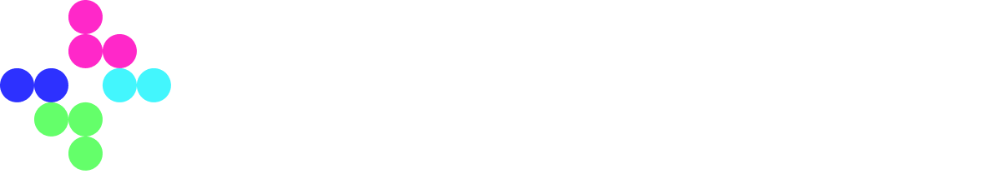

# 

**A Rocket League aim training platform.**

Master your aerial mechanics, visualize your rotations, and perfect your ball control with a professional-grade simulation engine built for the community.

---

## 📽️ Demo

  <video src="public/videos/demo/airdribble-demo.mp4" width="100%" controls autoplay muted loop style="border-radius: 12px; box-shadow: 0 10px 30px rgba(0,0,0,0.5);"></video>

---

## ✨ Key Features

- **🎯 Real-time 3D Simulation**: High-fidelity car and ball physics powered by Three.js.
- **🔄 Mechanics Visualization**: Real-time display of rotation axes, forward vectors, and helper donuts to demystify directional air roll.
- **🎮 Precision Controls**: Full support for Keyboard and Gamepad (Xbox/PlayStation) with low-latency input handling.
- **🏆 Training Modes**:
    - **Freeplay**: Endless practice with score tracking and instant resets.
    - **Challenge Mode**: Add pressure with countdowns and time limits to test your consistency.

---

## 🛠️ Tech Stack

Airdribble is built with a modern, high-performance stack designed for responsiveness and scalability.

| Layer | Technology |
|---|---|
| **Frontend** | [Next.js 15+](https://nextjs.org/), [React 19](https://react.dev/), [TypeScript](https://www.typescriptlang.org/) |
| **3D Rendering** | [Three.js](https://threejs.org/) |
| **Styling** | [Tailwind CSS v4](https://tailwindcss.com/), [Shadcn UI](https://ui.shadcn.com/) |
| **Backend** | [Go (Golang)](https://go.dev/) |
| **Database** | [Turso](https://turso.tech/) (SQLite) |
| **Deployment** | [Vercel](https://vercel.com/) |

---

## 🏗️ Architecture Overview

The core simulation uses a **fixed-step physics engine** to ensure consistent behavior across different hardware and frame rates.

- **Fixed Timestep**: The engine runs at `1/136s` (FIXED_DT), separating simulation stability from monitor refresh rate.
- **Ray-Based Hit Detection**: Precision ball interactions using directional rays and DPS-limited damage systems.
- **Modular Design**: Orchestrated by [src/Engine.js](src/Engine.js), connecting the [Controller](src/Controller.js), [Car](src/Car/Car.js), and [BallManager](src/Ball/BallManager.js).

## 💬 Community & Feedback

> *"The single most incredible thing I've seen RL related in such a long time."*
> — **r/RocketLeagueSchool User**

Airdribble was born out of a desire to provide better visualization for complex aerial mechanics. The project has received overwhelming support from the Rocket League community for helping players bridge the gap between "feel" and "physics."

Read the full discussion [here](https://www.reddit.com/r/RocketLeagueSchool/comments/1ovdu2o/directional_air_roll_visualized_in_real_time/).

---

## 📜 Credits & Licenses

This project uses professional 3D models from Sketchfab, licensed under [CC-BY-4.0](http://creativecommons.org/licenses/by/4.0/):
- **Octane, Fennec, Dominus, & Ball** by [Jako](https://sketchfab.com/fairlight51).

---

## ⚖️ License
MIT © [Manraj Pannu](https://github.com/manrajpannu)

